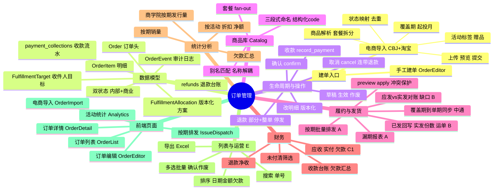

# 订单管理 — 全景概览

> 一页看懂整个订单管理模块:建单 → 建模 → 生命周期 → 商品库 → 履约发货 → 财务 → 统计 → 列表运营。
> 思维导图用 Mermaid,GitHub / 支持 Mermaid 的 Markdown 预览里会渲染成脑图。最后更新:2026-06-29。

## 思维导图

## 能力清单

| 板块 | 能力 | 关键实现 |
|---|---|---|
| **建单入口** | 手工建单/编辑(明细+履约目标+定价预览) | `OrderEditor.tsx`、`order_service.create_order_draft` |
| | 电商导入(CBJ 小程序 + 淘宝,自动识别平台) | `cbj_order_import_service`、`taobao_order_import_parser`、上传→预览→提交 |
| **数据模型** | 4 层订单树 + append-only 审计 + 退款/收款台账 | `Order→OrderItem→FulfillmentAllocation→FulfillmentTarget`、`OrderEvent`、`refunds`、`payment_collections` |
| | 双状态:内部 `OrderStatus` + 平台 `commercial_status` | `models/order.py` |
| **生命周期** | 草稿→生效→作废;确认;版本化改明细;退款;取消;收款 | `order_service`:confirm/void/update_order_items/refund_order/cancel_order/record_payment |
| **商品库** | 三段式命名 + 结构化 code + 别名匹配(名称↔识别解耦) + 套餐拆分 | `Product`、`product_resolver_service`、`/products` |
| **履约发货** | 覆盖期→单期中通发货明细同步(preview/apply,冲突保护) | `order_shipping_sync_service` |
| | 按期批量排发 + 漏期报表(A) | `order_shipping_batch_service`:gap_report/apply_all_for_issue |
| | 已发货回写(实发份数/运单)+ 应发vs实发对账缺口(B) | shipped_at/shipped_quantity/tracking_no、reconcile_issue/ship_all_for_issue |
| **财务** | 应收/实付/欠款追踪 + 收款流水 + 退款净收 + 欠款汇总(C1) | `payment_collections`、record_payment、outstanding、`/analytics/outstanding` |
| **统计分析** | 按活动(折扣+净额)/按期销量/商学院按期发行量/欠款汇总 | `order_analytics_service`、`/api/analytics/*` |
| **列表运营** | 单号搜索/服务端排序/多筛选/多选批量确认作废/导出 Excel/行内确认(E) | `list_orders`、bulk_confirm/void、`/orders/export`、`OrderList.tsx` |

## 接口索引(`/api/orders` 等)

**订单 CRUD / 生命周期**
- `GET /api/orders` 列表(筛选:status/search/payer/campaign/platform/coverage/order_date/unpaid/has_drift + sort/order)
- `GET /api/orders/export` 导出 .xlsx;`POST /api/orders/bulk-confirm`、`/bulk-void` 批量
- `POST /api/orders` 建草稿;`GET /{id}` 详情;`PUT /{id}` 改;`PUT /{id}/items` 版本化改明细
- `POST /{id}/confirm` 确认生效;`POST /{id}/void` 作废
- `POST /{id}/refund` 退款;`POST /{id}/cancel` 取消;`POST /{id}/payments` 记收款
- `GET /{id}/events` 审计流;`GET /{id}/fulfillment-progress` 履约进度(应得/已排/已发/缺口)
- `POST /api/orders/pricing-preview` 套餐定价预览

**履约 / 发货**
- `GET /{id}/shipping-sync/preview`、`POST /{id}/shipping-sync/apply` 单订单×单期同步
- `POST /{id}/shipping-sync/apply-all-issues` 本单全部期一次排齐
- `GET /shipping-sync/issues/{n}/gap-report` 漏期报表;`POST …/apply-all` 某期一键排发
- `GET /shipping-sync/issues/{n}/reconciliation` 应发vs实发对账;`POST …/ship-all` 一键标已发
- `POST /api/shipping-details/{id}/ship`、`/unship` 逐行标已发/撤销

**导入 / 统计**
- `POST /api/order-import/preview`、`/commit` 电商导入两段式
- `GET /api/analytics/campaigns`、`/issues`、`/bs-circulation`、`/outstanding`

## 数据表 / 迁移(订单域)

`orders`、`order_items`、`fulfillment_allocations`、`fulfillment_targets`、`order_events`、`products`、`bs_issues`、`shipping_details`(+order 关联列/shipped_quantity/tracking_no)、**`refunds`**、**`payment_collections`**。

订单域字段/表的关键迁移:`campaign`、`original_amount`、`commercial_status`+`is_historical_archive`、`issue_label`、`bs_issues`、`refunds`(`f7a2c4e6b8d0`)、`shipping_details` 实发列(`a9c3e5f70b21`)、`payment_collections`(`c1d3f5a7b9e2`)。

## 前端页面

| 页面 | 路由 | 作用 |
|---|---|---|
| 订单列表 | `/orders` | 搜索/排序/筛选/批量/导出/行内确认/作废 |
| 订单详情 | `/orders/:id` | 明细/履约进度/收款退款台账/金额区/发货同步 Tab/事件流;退款·取消·收款·同步全部期 按钮 |
| 订单编辑 | `/orders/new`、`/orders/:id/edit` | 手工建单/改单 |
| 电商导入 | `/orders/import` | CBJ/淘宝 上传→预览→导入 |
| 按期排发 | `/orders/dispatch` | 漏期报表 + 一键排发 + 本期对账(应发/已发/缺口)+ 标已发 |
| 活动订单统计 | `/analytics` | 按活动/按期/商学院发行量/欠款汇总 |
| 商品库 | `/products` | 商品 CRUD + 命名规则 |

## 闭环视角(两条主线)

- **履约闭环**:下单 → (商品解析) → 订单生效 → **排发(A)** 生成中通发货明细 → **已发回写(B)** → **应发vs实发对账(B)** 查缺口。
- **财务闭环**:应收(`total_amount`) → **收款(C1)** 累加实付 → **欠款** 追踪/未付清/汇总;**退款(退款闭环)** 净收冲减 + 停发;**取消** 连带全额退款。

## 本会话(2026-06-27 ~ 29)交付

1. **5 个正确性 bug**:退款单仍发货/作废单仍发货/has_drift 分页/日期筛/月刊期数高估。
2. **退款闭环**:`refunds` 台账 + 全额/部分退(三场景停发)+ 取消 + 营收净额冲减。
3. **A 按期批量排发 + 漏期报表**。
4. **B 已发货回写 + 应发vs实发对账**。
5. **C1 收款 / 欠款追踪**(`payment_collections` + 未付清 + 欠款汇总)。
6. **E 列表增强**:搜索/排序/批量确认作废/导出/行内确认。

**待办**:D 邮局履约自动产出、F 订单端点 require_admin 授权、C2 经营报表(月度营收走势/同比 + 统计导出);小项:自动补寄、中通回执导入、按份数的退款净额、发货定时调度。
