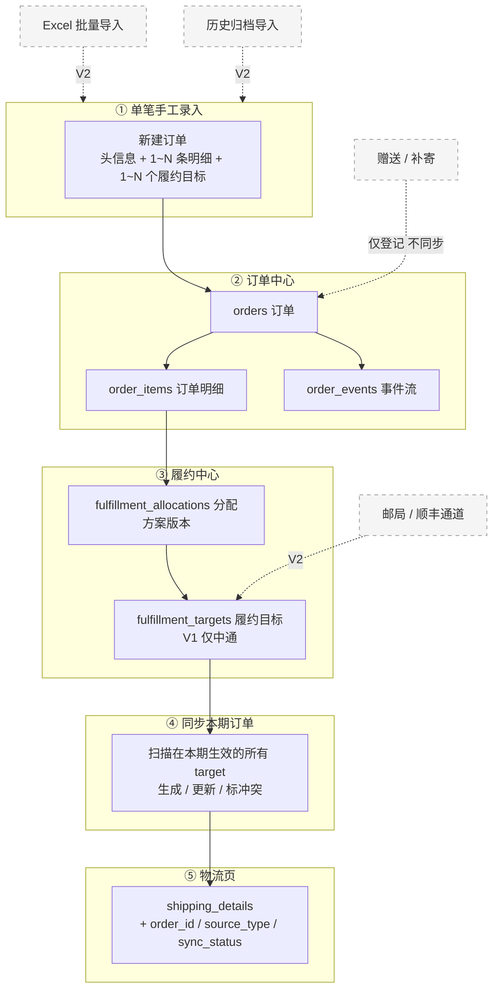
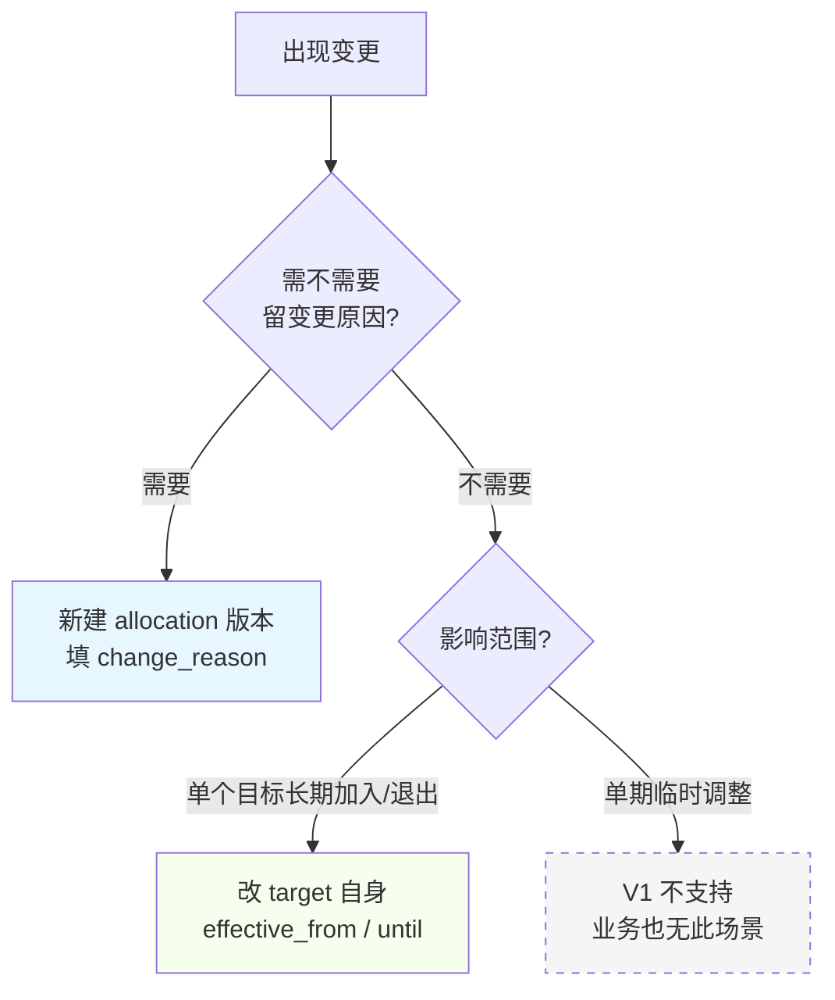
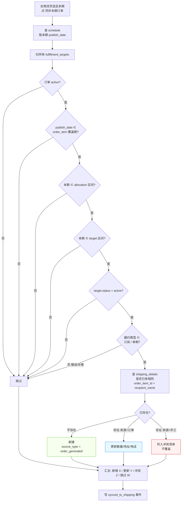
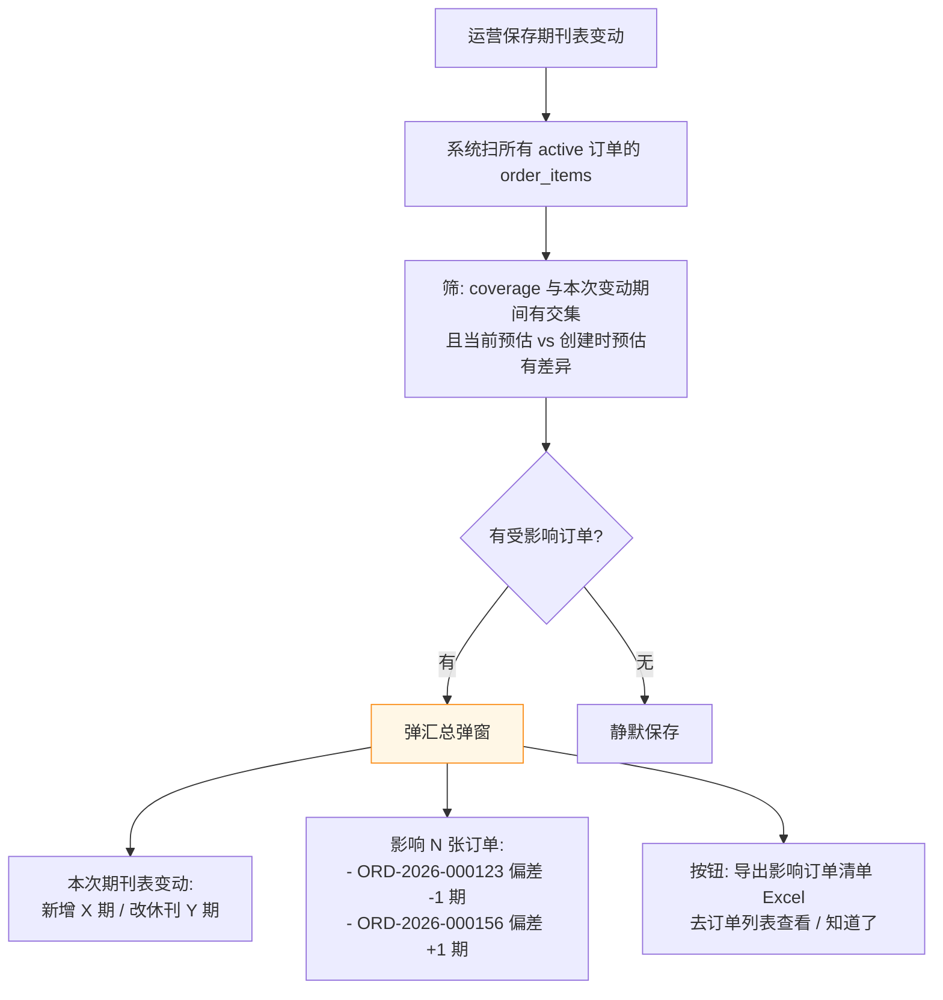
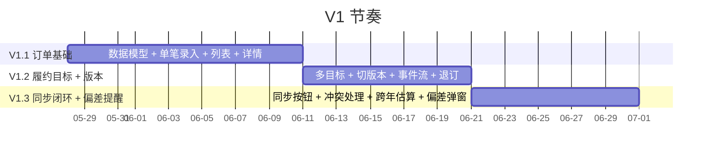

# 订单管理模块设计（V1 - MVP 简化版）

> **本文档替代** `2026-05-27-order-management-design.md` 作为 V1 实施依据。
> 上一版包含批量导入、历史归档、邮局/顺丰通道等较重内容，本版进一步收紧到 MVP：
> **只做"单笔手工录入 → 自动同步到当期 ZTO-MF"这一条主链**，其余全部推到 V2。

## 背景

系统当前已支持印数管理、刊期管理、ZTO-MF 中通明细等中段能力，但所有"应发数据"
仍靠运营手工抄录到物流页面，订单与发货之间没有结构化关联。

业务方常态订单量极小（每周几单），高峰单周可达数百单；非常规履约约占 20%
（退订、补寄、赠送、延期补偿、订户替换）。

V1 选择**最小可用**作为切入：先让"一张订单"能正确驱动当期中通明细生成，
跑通主链后再叠加导入、归档、邮局通道等能力。

## 目标

- 把订单作为系统的业务源头，**单笔订单确认后自动驱动当期中通明细生成**。
- 提供**单笔手工录入**入口，覆盖运营日常少量订单场景。
- 支持 4 种订单履约类型：长期订阅、单期、赠送、补寄。
  其中订阅/单期**自动同步**到中通明细；赠送/补寄**仅登记**，由运营手工去 ZTO-MF 加。
- 支持单条订单明细按多个履约目标分配份数（团购场景 A3/B3/C2/D2）。
- 支持按刊期切换分配方案版本，老版本可回溯，不覆盖历史。
- 现有"印数 / 刊期 / 物流"功能保持原样，订单模块以新增方式并行存在。
- 现有"订阅 / 收件人"页面 V1 完全不动，保留运营逃生通道。

## 非目标（V1 明确不做）

| 不做项 | 推到 |
|---|---|
| Excel 批量导入 | V2 |
| 历史订单归档导入 | V2 |
| 邮局 / 顺丰物流通道（只做中通） | V2 |
| 商学院、数字版报种 | 单独一轮设计 |
| 合刊处理（报纸本身不合刊） | 商学院专项 |
| 停刊顺延 / 延期补偿 | V2 |
| 客户档案合并去重 | V2 客户中心 |
| 发票生成 / 手续费拆分 / 对账 | V2 财务中心 |
| 邮局年度结算窗口截断 | V2 邮局专项 |
| 赠送 / 补寄 / 订户替换的自动履约 | V2 |
| 续订提醒 / 客户经营分析 | V2 |
| 第三方平台 API（淘宝/有赞/CBJ） | V3 待评估 |
| 改"订阅 / 收件人"页面 | V2 决定退役 |
| 履约完成状态机 | 不做，订单一直 active 至手动 void |
| 单期临时暂停 | 不做（业务无此场景） |

## 系统总览



## 核心概念

| 概念 | 像什么 | 关心什么 |
|---|---|---|
| **订单** | 客户合同 | 谁、什么报种、多少钱、覆盖期 |
| **订单明细** | 合同里的"商品行" | 报种、履约类型、覆盖期（日期段）、总份数 |
| **分配方案版本** | 整张"发货清单"的快照 | 整体怎么分、为什么改、要留痕 |
| **履约目标** | 清单上每一行收件人 | 这个人收几份、寄到哪、什么时候开始/退出 |
| **shipping_details** | 中通明细一行 | 本期实际寄给某人某地的快递行 |

## 数据模型

### 1. `orders`（订单主表）🆕

| 字段 | 类型 | 说明 |
|---|---|---|
| id | int PK | |
| order_code | str(64) | 业务编码（自动生成 `ORD-YYYY-NNNNNN`） |
| external_order_no | str(128), nullable, index | 来源平台原始单号 |
| order_date | date, not null | 下单日期 |
| source_type | enum, not null | `ecommerce` / `corporate_transfer` / `vip_gift` / `manual` / `mail_annual` |
| source_platform | str(64) | 平台名（自由文本，CBJ+小程序 / 淘宝发行部 / 有赞 / 对公转账 / VIP赠阅 等） |
| source_store | str(128), nullable | 店铺/同事名 |
| payer_name | str(128) | 付款主体名 **V2 客户中心打标依据，不要硬合并** |
| payer_contact | str(64), nullable | 付款联系人 |
| payment_method | enum | `wechat` / `alipay` / `bank_card` / `corporate_transfer` / `cash` / `offset` / `other` |
| payment_collector | str(64), nullable | 收款经办人姓名 |
| total_amount | decimal(10,2), default 0 | 订单总金额 **V2 财务回算依据，必须认真填** |
| paid_amount | decimal(10,2), default 0 | 已付金额 |
| invoice_required | bool, default false | 是否需要开票 |
| invoice_title | text, nullable | 开票抬头自由文本（V2 结构化） |
| status | enum, not null, default `draft` | `draft` / `pending_confirmation` / `active` / `void` |
| notes | text, nullable | 备注 |
| created_at, updated_at | datetime | |
| created_by | int FK users | |

索引：`(external_order_no)`、`(source_type, status, order_date)`、`(payer_name)`

V2 钩子：保留 `import_batch_id` / `import_row_no` / `import_source_sheet` 字段（V1 全部为 NULL）。

### 2. `order_items`（订单明细）🆕

| 字段 | 类型 | 说明 |
|---|---|---|
| id | int PK | |
| order_id | int FK orders, cascade | |
| publication | enum, not null | V1 固定 `cbj`；枚举保留 `business_school` / `other` |
| publication_format | enum, default `paper` | V1 固定 `paper`；枚举保留 `digital` |
| fulfillment_type | enum, not null | `subscription` / `single_issue` / `gift` / `makeup`；枚举保留 `extension` / `replacement` |
| billing_type | enum, not null | `paid` / `free_gift` / `bundle_gift` |
| coverage_start_date | date, nullable | 覆盖起投日（订阅/单期用） |
| coverage_end_date | date, nullable | 覆盖终止日 |
| issue_number | int, nullable | 指定刊期（仅 `single_issue` 用） |
| total_quantity | int, default 1 | 该明细订购总份数 |
| unit_price | decimal(10,2), default 0 | 单价 |
| subtotal | decimal(10,2), default 0 | 小计金额 |
| **expected_issues_at_creation** | int, nullable | **创建时预估期数**，用于偏差提醒 |
| status | enum, default `active` | `active` / `cancelled` |
| notes | text, nullable | |
| created_at, updated_at | datetime | |

索引：`(order_id)`、`(publication, fulfillment_type, status)`、`(coverage_start_date, coverage_end_date)`

### 3. `fulfillment_allocations`（履约分配方案版本）🆕

| 字段 | 类型 | 说明 |
|---|---|---|
| id | int PK | |
| order_item_id | int FK | |
| version_no | int, not null | 同一 order_item 下递增 |
| effective_from_issue | int, nullable | 从哪一期起生效（含本期） |
| effective_until_issue | int, nullable | 到哪一期失效（含本期）；null = 无上限 |
| change_reason | str(255) | 变更原因 |
| operator_id | int FK users | |
| created_at | datetime | |

唯一约束：`(order_item_id, version_no)`

V1 中订单确认即创建 v1 版本；后续每次"整体大调"或"需要留 change_reason"时生成新版本。
新建 v2 时，系统自动把 v1 的 `effective_until_issue` 设为 `v2.from - 1`。

### 4. `fulfillment_targets`（履约目标 / 分配项）🆕

| 字段 | 类型 | 说明 |
|---|---|---|
| id | int PK | |
| order_item_id | int FK | |
| allocation_id | int FK fulfillment_allocations | 属于哪一版分配方案 |
| recipient_name | str(128) | 收件人姓名 **V2 客户中心打标依据** |
| recipient_phone | str(64), nullable | |
| recipient_address | text | |
| recipient_postal_code | str(20), nullable | |
| quantity | int, default 1 | 这一目标分到几份 |
| shipping_channel | enum, not null | V1 固定 `zto_outsource`；枚举保留 `post_office` / `self_sf` / `other` |
| effective_from_issue | int, nullable | 该目标从哪一期开始生效（含本期） |
| effective_until_issue | int, nullable | 该目标到哪一期失效（含本期） |
| status | enum, default `active` | `active` / `suspended` / `replaced` |
| replaced_by_target_id | int, nullable | **V2 订户替换链钩子**，V1 不填 |
| notes | text, nullable | |
| created_at, updated_at | datetime | |

索引：`(order_item_id, allocation_id)`、`(effective_from_issue, effective_until_issue, status)`

### 5. `order_events`（订单事件流）🆕

记录订单生命周期内所有变更：

- `created`、`confirmed`、`modified`、`split`、`voided`
- `allocation_updated`、`target_added`、`target_replaced`、`target_suspended`
- `synced_to_shipping`、`shipping_sync_conflict`

V2 还会用到：`imported`（V1 不会触发）

字段：`id, order_id, event_type, payload_json, operator_id, created_at`。

### 6. 现有 `shipping_details` 表追加字段 ✏️

| 字段 | 类型 | 说明 |
|---|---|---|
| order_id | int FK orders, nullable | 来源订单（NULL = 手工录入或历史数据） |
| order_item_id | int FK order_items, nullable | |
| fulfillment_target_id | int FK fulfillment_targets, nullable | |
| source_type | enum, default `manual` | `manual` / `order_generated` / `historical_import` |
| sync_status | enum, default `synced` | `synced` / `manually_modified` / `orphaned` |

新增索引：`(order_id)`、`(source_type)`。

### V2 才会新建的表（V1 不建）

- `order_import_batches` — Excel 批量导入批次
- `order_import_staging` — 待确认导入区

## 业务流程

### 流程 1：单笔手工录入


**规则**：

- 报种**固定中经报**；UI 可不暴露报种选择，后台默认 `cbj`。
- 物流通道**固定中通**；UI 可不暴露通道选择，后台默认 `zto_outsource`。
- 履约类型可选 4 种：订阅 / 单期 / 赠送 / 补寄。
- 订单确认时**自动计算并保存** `expected_issues_at_creation`（订阅/单期才算；赠送/补寄不算）。

### 流程 2：履约分配方案变更（团购场景）

#### 何时改 target，何时开新版本



| 操作类型 | 用什么 | 留痕在哪 |
|---|---|---|
| 多目标同时大调 / 需留原因（收件人变更、份数大改） | 新建 allocation 版本 | `allocations.change_reason` + `order_events.allocation_updated` |
| 单个目标长期加入 / 退出 | 改 target 的 `effective_from` / `effective_until` | `order_events.target_added` |
| 订户**退订** | 改 target 的 `effective_until_issue` | `order_events.target_replaced` 或 `modified` |

#### 新建版本的边界规则

- `effective_from_issue` **含本期**，符合"自第 X 期起按新方案"的口语表达。
- 新建 v2 时，系统**自动**把 v1 的 `effective_until_issue` 设为 `v2.from - 1`，避免两版同时生效。

#### 同步判定规则

```
本期 publish_date ∈ order_item.coverage_start ~ coverage_end       AND
本期 issue_number ∈ allocation.effective_from ~ effective_until    AND
本期 issue_number ∈ target.effective_from ~ effective_until        AND
target.status = active                                              AND
order_item.fulfillment_type ∈ {subscription, single_issue}
=>  生成一行 shipping_details
```

### 流程 3：订单 → 当期 `shipping_details` 同步



**字段映射规则**：

| `shipping_details` 字段 | 来源 |
|---|---|
| issue_number | 同步操作选定的本期 |
| name | `fulfillment_targets.recipient_name` |
| address | `fulfillment_targets.recipient_address` |
| phone | `fulfillment_targets.recipient_phone` |
| quantity | `fulfillment_targets.quantity` |
| transport | 固定"中通物流"（V1 仅一种通道） |
| channel | `orders.source_type + source_platform` 静态映射 |
| sub_channel | `orders.source_store` |
| frequency | 固定"每周"（V1 仅中经报） |
| status | 默认"正常" |

**注意**：

- 休刊期 schedule 中 `issue_number = NULL`，遍历期数时根本扫不到，**同步逻辑不需要单独判 `is_suspended`**。
- 历史订单（V1 不存在；V2 标 `historical_archive` 的批次）**不参与同步**。

## 业务规则细节

### 1. 订单覆盖期 vs 分配方案切换期

两套字段，**职责完全分开**：

| 字段 | 类型 | 谁定义 | 何时变 |
|---|---|---|---|
| `order_items.coverage_start_date` / `coverage_end_date` | date | **客户合同** | 录单时填，原则上不动 |
| `fulfillment_allocations.effective_from_issue` / `effective_until_issue` | int | **运营调整** | 运营换分配方案时变 |
| `fulfillment_targets.effective_from_issue` / `effective_until_issue` | int | **运营调整** | 单目标加入/退出/退订时变 |

### 2. 跨年订阅的"估算期数"与偏差提醒

#### 录单时

订单覆盖期可能跨越未来还没录入的期刊表（例 `2026-03-01 ~ 2027-02-28`）：

- **不强制要求** 2027 期刊表就位即可保存订单。
- 系统按"当下 schedule + 估算"计算 `expected_issues_at_creation`：
  - 已录入部分：`COUNT(schedule WHERE publish_date ∈ coverage AND issue_number IS NOT NULL)`
  - 未录入部分：`(coverage_end - max(schedule.publish_date)) / 7` 粗算
- 该值**只在订单确认时算一次**并落 `expected_issues_at_creation` 字段。

#### 详情页实时展示

```
履约进度
─────────────
覆盖期: 2026-03-01 ~ 2027-02-28
创建时预估: 48 期
当前预估: 47 期 ⚠️ 偏差 -1 期
已同步: 12 期
─────────────
[查看变化详情]
```

- "当前预估"**实时计算**，不落库。
- 偏差判定：`current_expected - expected_issues_at_creation != 0`。

#### 期刊表保存后的汇总弹窗



#### 订单列表筛选器

订单列表筛选器加一项「期数偏差」：`全部 / 含偏差订单 / 无偏差订单`。

### 3. 休刊处理

- 现有 `PublicationSchedule` 表：休刊周 `issue_number = NULL` + `is_suspended = true` + `publish_date` 有值。
- **休刊期不发快递**：同步遍历的是 `issue_number` 非空的期，休刊周自然不在范围内。
- **休刊不补偿、不顺延**：业务上"订全年"本来就含休刊（春节 2 期 + 国庆 1 期），订单 `coverage_end_date` 按原合同不变。

### 4. 物流通道

- V1 `fulfillment_targets.shipping_channel` 枚举完整保留（中通 / 邮局 / 顺丰 / 其他），
  但 **UI 创建/编辑时不暴露选项**，后端固定写入 `zto_outsource`。
- V2 开放邮局通道时，加 UI 选项即可，不动数据模型。

### 5. 履约状态机

- V1 **不做"履约完成"状态**。
- 订单从 `draft → pending_confirmation → active`，一直 `active` 到运营手动 `void` 或新订单接续。
- 履约进度通过详情页**计算展示**，不存数据库。

## 前端设计

### 菜单调整

```
原侧边栏:                   V1 上线后:
├ 印数管理                   ├ 印数管理
├ 刊期表管理                 ├ 刊期表管理
├ 物流管理                   ├ 订单管理     🆕
│  ├ 收件人                  │  ├ 订单列表
│  └ ZTO-MF                  │  ├ 新建订单
└ 历史导入                   │  └ (无导入/归档子页)
                             ├ 物流管理
                             │  ├ 收件人    (不动)
                             │  └ ZTO-MF    ✏️ 加同步按钮+来源列
                             └ 历史导入
```

### 关键页面

#### 1. 订单列表 (`/orders`) 🆕

- 筛选：状态、来源类型、来源平台、覆盖期、付款主体关键字、**期数偏差**（全部 / 含偏差 / 无偏差）。
- 列：订单编码、来源单号、下单日期、付款主体、份数总计、金额、覆盖期、状态、**期数（已同步/计划 含偏差标记）**、操作。
- 顶部按钮："新建订单"、"导出列表"。
- 不显示"批量导入"、"历史归档"（V1 不做）。

#### 2. 订单详情 (`/orders/:id`) 🆕

- 头部：订单信息（来源、付款、金额、状态、备注）。
- Tab 1：订单明细 + 每条明细下的履约目标列表 + 履约进度卡片。
- Tab 2：分配方案版本历史（v1 / v2 / ...，含 change_reason）。
- Tab 3：关联 `shipping_details`（按期号分组）。
- Tab 4：事件流。

#### 3. 新建/编辑订单 (`/orders/new`、`/orders/:id/edit`) 🆕

- 单页 + 折叠区块：订单头 → 明细列表 → 每条明细的履约目标列表。
- 报种、通道字段不暴露（默认值由后端填）。
- 保存草稿 / 确认生效两步。

### 现有页面改动

#### 物流管理 → ZTO-MF ✏️

- 列表新增"来源"列：手工 / 订单生成 / 历史导入。
- 行点击"来源订单"跳订单详情。
- 行编辑保存时若 `source_type = order_generated`，提示"该行来自订单 #XXX，建议回订单中修改履约目标"，不强制阻止。
- 顶部新增"同步本期订单"按钮（与"清空本期"并列）。
- 同步结果展示在抽屉：新增 X / 更新 Y / 冲突 Z / 跳过 W。

#### 刊期表管理 ✏️

- 保存变动后，若有受影响订单，弹"期数偏差汇总弹窗"：
  - 列出受影响订单及偏差值。
  - 按钮：「导出影响订单清单」（下载 Excel）、「去订单列表查看」、「知道了」。

### TanStack Query 缓存键

- `['orders', filters]`
- `['order', id]`
- `['order-events', orderId]`
- `['order-fulfillment-progress', orderItemId]` — 详情页履约进度
- 现有 `['shipping-details', issueId]` 在同步操作后失效
- 现有 `['publication-schedule']` 在保存后触发偏差检测后端查询

## V2 钩子（V1 必须留好但不用的字段）

| 钩子 | 位置 | V2 何时用 |
|---|---|---|
| 字段独立不合并 | `orders.payer_name` / `recipient_*` / `invoice_title` | V2 客户中心打标 |
| 账面金额完整 | `orders.total_amount` / `paid_amount` | V2 财务回算 |
| 事件流完整 | `order_events` 全事件 | V2 审计 / 客户行为分析 |
| 来源标识 | `shipping_details.source_type` | V2 渠道分析 |
| 替换链 | `fulfillment_targets.replaced_by_target_id` | V2 订户替换链 |
| 履约类型枚举完整 | `order_items.fulfillment_type` 含 `extension` / `replacement` | V2 自动履约扩展 |
| 物流通道枚举完整 | `fulfillment_targets.shipping_channel` 含 `post_office` / `self_sf` | V2 邮局通道 |
| 批次模式预留 | `orders.import_batch_id` / `import_row_no` / `import_source_sheet` | V2 批量导入 |

## 数据迁移与兼容

- V1 不迁移现有 `recipients` / `subscriptions` / `shipping_records` 任何数据。
- 新增表通过 SQLAlchemy 模型自动建表；如需 Alembic 迁移，遵循现有项目脚本风格。
- 现有 `shipping_details` 加字段为可空、可默认，不影响现有读写。

## 测试要点

- **模型层**：订单/明细/分配方案/履约目标的级联、唯一约束、状态机。
- **服务层**：
  - 同步引擎的三层生效期判定（allocation × target × status）
  - 跨年订单 `expected_issues_at_creation` 估算
  - 期刊表变动触发的偏差检测
  - 同步冲突（手工 vs 订单生成）
- **接口层**：列表筛选、订单确认、版本切换、同步、偏差导出。
- **前端**：
  - 新建订单流程
  - 订单详情各 Tab
  - 物流页"同步本期订单"
  - 期刊表保存后弹窗
- **关键边界**：
  - 团购订单 1 条明细多目标（A3/B3/C2/D2）
  - 分配方案版本切换的边界期归属（含 v2.from = 自动收尾 v1.until）
  - 退订（target.effective_until 提前到某期 - 1）
  - 跨年订单偏差检测
  - 休刊期同步时被自然跳过
  - 订单作废后已生成 shipping_details 的 `sync_status = orphaned`

## 实施分期

V1 内部仍可分成 3 个连续可交付的小阶段：

| 阶段 | 内容 | 交付价值 | 估算工期 |
|---|---|---|---|
| **V1.1 订单基础** | 数据模型 + 单笔录入 + 订单列表 + 详情（不含版本切换、不含同步） | 用户可手工录入并查看订单 | ~2 周 |
| **V1.2 履约目标 + 版本** | 多履约目标、按刊期切版本、事件流、退订支持 | 团购订单、地址变更、退订可建模 | ~10 天 |
| **V1.3 同步闭环 + 偏差提醒** | 同步按钮、冲突处理、物流页改动、跨年估算、偏差弹窗 + 导出 | 主链闭环跑通 | ~10 天 |

约 5 周分 3 阶段，每个阶段独立可上线。



## 待确认的开放问题

V1 设计阶段所有关键决策已经收口（见下方决策记录）。
以下问题留待**实施过程中根据实际数据再调整**：

1. **`expected_issues_at_creation` 跨年估算公式的精度** — 初版用粗算（周数 - 估算休刊），若误差大可改为"按上一年同月规律折算"。
2. **同步冲突 (`source_type = manual`)** 的解决体验 — V1 仅"列入清单"，是否需要给运营提供"一键覆盖为订单值"按钮，看试用情况。
3. **订单作废 → shipping_details 处理** — V1 推荐：作废订单不主动删 shipping_details，但将其 `sync_status = orphaned` 标记并在物流页提示。

## 决策记录

V1 设计共 32 条决策固化（来源于 2026-05-28 多轮讨论），完整列表见会话决策表。
关键决策摘要：

| 范围 | 关键决策 |
|---|---|
| **范围收紧** | V1 = MVP，仅单笔录入 + 中通同步闭环；批量导入/历史归档/邮局通道全部 V2 |
| **报种** | V1 仅中经报；商学院、数字版后续单独设计 |
| **通道** | V1 仅中通；邮局/顺丰枚举保留 |
| **履约类型** | 订阅/单期自动同步；赠送/补寄仅登记；退订归 V1 用 target.until 实现；延期/订户替换 V2 |
| **覆盖期表达** | 订单覆盖期用日期段；分配方案/履约目标切换用期号 int |
| **跨年订单** | 不要求未来 schedule 就位；按"当下 + 估算"算 expected_issues_at_creation |
| **同步判定** | publish_date ∈ coverage AND 期号 ∈ allocation 区间 AND 期号 ∈ target 区间 AND status = active AND 类型 ∈ 订阅/单期 |
| **版本切换** | from 含本期，新建 v2 自动收尾 v1.until = v2.from - 1 |
| **休刊** | 期号 NULL 自然跳过；不顺延、不补偿 |
| **变更分流** | 多目标同时变 / 留原因 → 新版本；单目标加入退出 → 改 target 生效期；退订 → 改 target.until |
| **履约状态机** | 不做"完成"态；订单一直 active 至手动 void |
| **偏差提醒** | 方案 B：详情页实时算 + 期刊表保存后弹汇总 + 列表筛选 + Excel 导出 |
| **V2 钩子** | 字段独立、事件流齐全、source_type 区分、replaced_by_target_id 预留、import_batch 字段预留 |
